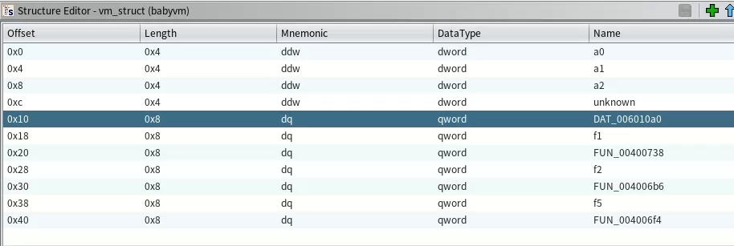

### 一、典型cpu结构和指令

#### 1、典型的32位cpu寄存器：
```
    EAX     0x0
    ECX     0x0     ; 循环计数寄存器，用于 loop 指令
    EDX     0x0
    EBX     0x0
    ESP     0xFF    ; 栈顶指针
    EBP     0x0     ; 基址寄存器，用于函数的参数定位的不变基准地址
    ESI     0x0     ; 串指令源地址寄存器
    EDI     0x0     ; 串指令目的地址寄存器
    EIP     0x0     ; 指令指针寄存器
    EFLAG   0x0     ; 状态/标志寄存器，用于程序分支指令。
```
现代CPU设计的通用寄存器实际上都可以进行运算，只是特定的功能指令，cpu设计的时候约定只用约定的寄存器。（如上面的注释）

#### 2、典型的32位x86指令
a、寄存器之间的传输（reg<-->reg）：
```
    mov eax, ebx  ; 将ebx寄存器的值复制到eax寄存器
```

b、内存和寄存器之间的传输（reg<-->mem）：
```
    mov eax, [ebp+8]  ; 从[ebp+8]内存位置读取数据并存储到eax寄存器
    mov dword ptr [edi], ebx  ; 将ebx寄存器的值存储到[edi]内存位置
```

c、立即数和寄存器之间的传输（reg<--常数）：
```
    mov ecx, 42  ; 将立即数42存储到ecx寄存器
```

指令一般在 reg（寄存器）/ mem（内存）/ 立即数, 之间进行操作，根据这个特性，可以以此为特征来识别 vm 的指令/寄存器/内存。

### 二、软件定义虚拟机原理

#### 1、由硬件到软件的映射（启发）
参考第一部分对CPU和指令的简单介绍，参考其格式，发现其实可以有如下映射关系：
```
    寄存器----------------------------数组
    指令------------------------------函数
    指令操作数-------------------------函数参数
```
通过上面的映射关系，可以发现，用软件模拟的方式，能自定义一套CPU的架构和指令集。这就是软件定义虚拟机。在自己定义的虚拟机上写代码，能有效的增加逆向分析的难度，从而更好的保护自己的软件资产。

#### 2、具体实现与逆向分析摘要
* 最简单的vm可以只实现通用寄存器，进行顺序计算。这种条件下只需要实现通用寄存器和EIP。
* 需要支持分支/跳转，就要增加 ESP/EFLAG。复杂度会极大增加。
* 逆向vm的时候，一般需要如下步骤：
  * 定位“指令集”（函数集）
  * 定位寄存器，一般是特定的数组
  * 定位EIP，识别指令寄存器，对于了解程序流程很重要
  * 定位EFLAG，识别标志寄存器，对于理解支持分支的vm很重要
  * 定位ESP，若vm支持函数调用，那么识别ESP就很重要。
  * 识别每一个“指令”及其参数，用脚本还原vm的code成为“伪代码”。
  * 通过分析“伪代码”了解vm code的算法。

### 三、例子一 babyvm

这是一个 ELF 64-bit LSB executable，用 ghidra 进行静态分析：
入口点调用函数：
``` 
 __libc_start_main(FUN_004009fd,param_2,&stack0x00000008,FUN_00400a70,UN_00400ae0,param_1,auStack_8);
```
第一个参数就是``` main ```函数。

```
undefined8 main(void)
{
  long in_FS_OFFSET;
  undefined8 local_18;
  long local_10;
  
  local_10 = *(long *)(in_FS_OFFSET + 0x28);
  local_18 = 0;
  puts("---------------------");
  puts("please input the flag:");
  FUN_00400839(&local_18);
  FUN_0040094e(&local_18);
  FUN_00400986();
  if (local_10 != *(long *)(in_FS_OFFSET + 0x28)) {
                    /* WARNING: Subroutine does not return */
    __stack_chk_fail();
  }
  return 0;
}
```
主函数逻辑很简单，就是关键中间的三个 FUN_ 开头的函数。一个个分析一下：

```
void FUN_00400839(undefined4 *param_1)
{
  *param_1 = 0;
  param_1[1] = 0;
  param_1[2] = 0;
  *(undefined1 **)(param_1 + 4) = &DAT_006010a0;
  *(undefined *)(param_1 + 6) = 0xf1;
  *(code **)(param_1 + 8) = FUN_00400738;
  *(undefined *)(param_1 + 10) = 0xf2;
  *(code **)(param_1 + 0xc) = FUN_004006b6;
  *(undefined *)(param_1 + 0xe) = 0xf5;
  *(code **)(param_1 + 0x10) = FUN_004006f4;
  DAT_00601158 = malloc(0x512);
  memset(DAT_00601158,0,0x512);
  return;
}
```

看上去把传入的参数作为一块存储区域，初始化了三个整数，一个地址，三个函数。然后分配了0x512大小的内存区域。既然明确告诉这题是vm，那么这些很可能就是第一部分提到的“寄存器/内存/指令”。

需要注意的是，传入的参数地址没有初始化的那么大，会覆盖main函数的返回地址栈空间。可能是出题者为了增加难度故以为之吧。（定义成数据结构后，ghidra 在main函数转换成伪C代码时，不能正确转换参数，不过影响不大）

```
void FUN_0040094e(long param_1)

{
  *(undefined1 **)(param_1 + 0x10) = &DAT_006010a0;
  while (**(char **)(param_1 + 0x10) != -0xc) {
    FUN_004008da(param_1);
  }
  return;
}
```

一个循环，看一下```DAT_006010a0```处的数据：

```
                             DAT_006010a0                                   
        006010a0 f5              undefined1 F5h
        006010a1 f1              ??         F1h
        006010a2 e1              ??         E1h
        006010a3 00              ??         00h
        006010a4 00              ??         00h
        006010a5 00              ??         00h
        006010a6 00              ??         00h
        006010a7 f2              ??         F2h
        006010a8 f1              ??         F1h
        006010a9 e4              ??         E4h
        006010aa 20              ??         20h     
        006010ab 00              ??         00h
        006010ac 00              ??         00h
        006010ad 00              ??         00h
        006010ae f1              ??         F1h
        006010af e1              ??         E1h
        006010b0 01              ??         01h
        006010b1 00              ??         00h
        006010b2 00              ??         00h
        006010b3 00              ??         00h
		...........
        00601143 f2              ??         F2h
        00601144 f1              ??         F1h
        00601145 e4              ??         E4h
        00601146 2c              ??         2Ch    ,
        00601147 00              ??         00h
        00601148 00              ??         00h
        00601149 00              ??         00h
        0060114a f4              ??         F4h

```

-0xC = 0xF4，很明显```FUN_0040094e```是执行```DAT_006010a0```处指令的函数。```0xf1/0xf2/0xf5```是指令的识别码。

```
void FUN_00400986(void)
{
  int local_18;
  
  local_18 = 0;
  while( true ) {
    if (0xb < local_18) {
      puts("right");
                    /* WARNING: Subroutine does not return */
      exit(0);
    }
    if (*(char *)(DAT_00601158 + (local_18 + 0x20)) != (&DAT_00601080)[local_18]) break;
    local_18 = local_18 + 1;
  }
  puts("error");
                    /* WARNING: Subroutine does not return */
  exit(0);
}
```

看上去就是比较vm运行后的结果，与```DAT_00601080```处的0xb个字节比较。

```
                             DAT_00601080                                   
        00601080 75              ??         75h    u
        00601081 6b              ??         6Bh    k
        00601082 51              ??         51h    Q
        00601083 00              ??         00h
        00601084 47              ??         47h    G
        00601085 6d              ??         6Dh    m
        00601086 6b              ??         6Bh    k
        00601087 42              ??         42h    B
        00601088 59              ??         59h    Y
        00601089 15              ??         15h
        0060108a 15              ??         15h
        0060108b 15              ??         15h
```

初步分析后，基本可以确定```FUN_00400839```函数初始化了 vm，传入的参数就是 vm 的结构体。可以根据初始化，对照汇编代码，快速定义一下这个 vm_struct。



可以发现确实是一个babym，只有三条指令。下面一个一个指令函数进行分析，同时确定 EIP/REG 等信息。

```
void FUN_00400738(vm_struct *param_1)
{
  byte bVar1;
  int *piVar2;
  
  piVar2 = (int *)(param_1->DAT_006010a0 + 2);
  bVar1 = *(byte *)(param_1->DAT_006010a0 + 1);
  if (bVar1 == 0xe2) {
    param_1->a1 = (int)*(char *)(DAT_00601158 + *piVar2);
  }
  else if (bVar1 < 0xe3) {
    if (bVar1 == 0xe1) {
      param_1->a0 = (int)*(char *)(DAT_00601158 + *piVar2);
    }
  }
  else if (bVar1 == 0xe3) {
    param_1->a2 = (int)*(char *)(DAT_00601158 + *piVar2);
  }
  else if (bVar1 == 0xe4) {
    *(char *)(DAT_00601158 + *piVar2) = (char)param_1->a0;
  }
  param_1->DAT_006010a0 = param_1->DAT_006010a0 + 6;
  return;
}
```

这应该是一个switch语句，ghidra相比IDA，在识别switch上要差一些。这个```f1```指令，功能上相当于多个```mov```指令的合集。很明显的```DAT_006010a0```就是```EIP```，```DAT_00601158```就是```mem```，vm_struct 的头三个成员就是 ```reg0/reg1/reg2```。这条指令的长度是 6。

（边分析，边将分析结果更新到ghidra的变量定义和命名上，让下面的分析更清晰）

```
void FUN_004006b6(vm_struct *vm)
{
  vm->reg0 = vm->reg1 ^ vm->reg0 ^ 0x34;
  vm->EIP = vm->EIP + 1;
  return;
}

```

```f2```指令是一个很明显的 ```XOR```指令。指令长度为1。

```
void FUN_004006f4(vm_struct *vm)
{
  read(0,DAT_00601158,0xc);
  vm->EIP = vm->EIP + 1;
  return;
}
```

```f5```指令就是一个read函数。指令长度为1。

结合```DAT_006010a0```处的指令代码，这个vm是一个不定长指令集。把上面的分析综合起来，将```DAT_006010a0```处的指令序列翻译成伪代码：

```
read(buf, 0xc)
mov reg0, buf[0]
xor reg0, reg1^0x34
mov buf[32], reg0
mov reg0, buf[1]
xor reg0, reg1^0x34
mov buf[33], reg0
mov reg0, buf[2]
xor reg0, reg1^0x34
mov buf[34], reg0
mov reg0, buf[3]
xor reg0, reg1^0x34
mov buf[35], reg0
mov reg0, buf[4]
xor reg0, reg1^0x34
mov buf[36], reg0
mov reg0, buf[5]
xor reg0, reg1^0x34
mov buf[37], reg0
mov reg0, buf[6]
xor reg0, reg1^0x34
mov buf[38], reg0
mov reg0, buf[7]
xor reg0, reg1^0x34
mov buf[39], reg0
mov reg0, buf[8]
xor reg0, reg1^0x34
mov buf[40], reg0
mov reg0, buf[9]
xor reg0, reg1^0x34
mov buf[41], reg0
mov reg0, buf[10]
xor reg0, reg1^0x34
mov buf[42], reg0
mov reg0, buf[11]
xor reg0, reg1^0x34
mov buf[43], reg0
mov reg0, buf[12]
xor reg0, reg1^0x34
mov buf[44], reg0
```

本质就是对读入的 0xb 个字节 xor 0x34，和```DAT_00601080```处进行比较。算法非常简单，解密出来就是：```A_e4sY_vm!!```

### 四、例子二 babyvm.exe

这是一个64位的windows程序，要比上一个复杂一些。

用ghidra打开分析，定位到main函数：

```
undefined8 FUN_140001660(void)
{
  FUN_140001230();
  for (; DAT_140006240 < 0xaf; DAT_140006240 = DAT_140006240 + 3) {
    (**(code **)(&DAT_140006250 +
                (ulonglong)*(uint *)(&DAT_140005040 + (ulonglong)DAT_140006240 * 4) * 8))
              (*(undefined4 *)(&DAT_140005040 + (ulonglong)(DAT_140006240 + 1) * 4),
               *(undefined4 *)(&DAT_140005040 + (ulonglong)(DAT_140006240 + 2) * 4));
  }
  return 0;
}
```

参考前面一个vm的例子，合理猜测```FUN_140001230```是初始化vm，循环是执行vm的指令序列（vm程序）。进一步分析来确定这个vm的结构。看初始化函数：

```
void FUN_140001230(void)
{
  BOOL BVar1;
  
  _DAT_140006480 = 0x7fb26948;
  _DAT_140006548 = 0x7fb26948;
  _DAT_140006484 = 0x66e871f1;
  _DAT_14000654c = 0x66e871f1;
  _DAT_140006488 = 0x604962e5;
  _DAT_140006550 = 0x604962e5;
  _DAT_14000648c = 0x3a9c8236;
  _DAT_140006554 = 0x3a9c8236;
  _DAT_140006490 = 0x67cc539e;
  _DAT_140006558 = 0x67cc539e;
  _DAT_140006494 = 0x5cb0410c;
  _DAT_14000655c = 0x5cb0410c;
  _DAT_140006498 = 0x22eb56b4;
  _DAT_140006560 = 0x22eb56b4;
  _DAT_14000649c = 0x22569dbf;
  _DAT_140006564 = 0x83a523c7;
  _DAT_1400064a0 = 0x8d5a7aaa;
  _DAT_140006568 = 0x84ef494e;
  _DAT_1400064a4 = 0x3063792e;
  _DAT_14000656c = 0x8aff24f2;
  _DAT_1400064a8 = 0x318ef3b1;
  _DAT_140006570 = 0x65407a4;
  _DAT_1400064ac = 0x5db4ce01;
  _DAT_140006574 = 0x1b8318e4;
  _DAT_1400064b0 = 0x8d53060e;
  _DAT_140006578 = 0x84ef494e;
  _DAT_1400064b4 = 0x26fdf441;
  _DAT_14000657c = 0x65407a4;
  _DAT_1400064b8 = 0x1ce65bab;
  _DAT_140006580 = 0x48976a24;
  _DAT_1400064bc = 0x26fdf441;
  _DAT_140006584 = 0x22569dbf;
  _DAT_1400064c0 = 0x3063792e;
  _DAT_140006588 = 0x20c38c12;
  _DAT_1400064c4 = 0x137061c0;
  _DAT_14000658c = 0x1bb10c23;
  _DAT_1400064c8 = 0x1ce65bab;
  _DAT_140006590 = 0x65407a4;
  _DAT_1400064cc = 0x5e85af08;
  _DAT_140006594 = 0x5134a288;
  _DAT_1400064d0 = 0x318ef3b1;
  _DAT_140006598 = 0x84ef494e;
  _DAT_1400064d4 = 0x26fdf441;
  _DAT_14000659c = 0x65407a4;
  _DAT_1400064d8 = 0x5db4ce01;
  _DAT_1400065a0 = 0x20c38c12;
  _DAT_1400064dc = 0x137061c0;
  _DAT_1400065a4 = 0x8d5a7aaa;
  _DAT_1400064e0 = 0x2989f25;
  _DAT_1400065a8 = 0x65407a4;
  _DAT_1400064e4 = 0x5e85af08;
  _DAT_1400065ac = 0x65407a4;
  _DAT_1400064e8 = 0x26fdf441;
  _DAT_1400065b0 = 0x26fdf441;
  _DAT_1400064ec = 0x588beb9f;
  _DAT_1400065b4 = 0x8aff24f2;
  _DAT_1400064f0 = 0x5db4ce01;
  _DAT_1400065b8 = 0x5134a288;
  _DAT_1400064f4 = 0x2989f25;
  _DAT_1400065bc = 0x65407a4;
  _DAT_1400064f8 = 0x50631110;
  _DAT_1400065c0 = 0x1ab5b47;
  _DAT_1400064fc = 0x50631110;
  _DAT_1400065c4 = 0x5134a288;
  _DAT_140006500 = 0x588beb9f;
  _DAT_1400065c8 = 0x904eb446;
  _DAT_140006504 = 0x2989f25;
  _DAT_1400065cc = 0x1b8318e4;
  _DAT_140006508 = 0x5db4ce01;
  _DAT_1400065d0 = 0x65407a4;
  _DAT_14000650c = 0x22569dbf;
  _DAT_1400065d4 = 0x1ce65bab;
  _DAT_140006510 = 0x318ef3b1;
  _DAT_1400065d8 = 0x22569dbf;
  _DAT_140006514 = 0x318ef3b1;
  _DAT_1400065dc = 0x35175131;
  _DAT_140006518 = 0x3e344fdd;
  _DAT_1400065e0 = 0x8d5a7aaa;
  _DAT_14000651c = 0x666df587;
  _DAT_1400065e4 = 0x666df587;
  _DAT_140006520 = 0;
  _DAT_1400065e8 = 0;
  _DAT_140006250 = &LAB_140001070;
  _DAT_140006258 = &LAB_140001080;
  _DAT_140006260 = &LAB_1400010b0;
  _DAT_140006268 = FUN_1400010c0;
  _DAT_140006270 = &LAB_1400010f0;
  _DAT_140006278 = &LAB_140001110;
  _DAT_140006280 = &LAB_140001130;
  _DAT_140006288 = &LAB_140001150;
  _DAT_140006290 = &LAB_140001170;
  _DAT_140006298 = &LAB_140001190;
  _DAT_1400062a0 = &LAB_1400011b0;
  _DAT_1400062a8 = &LAB_1400011d0;
  _DAT_1400062b0 = FUN_140001200;
  _DAT_1400062b8 = &LAB_140001210;
  BVar1 = IsDebuggerPresent();
  if (BVar1 != 0) {
    DAT_140005240 = 0x96;
  }
  return;
}
```

初始化函数里面首先对两个内存块```DAT_140006480```和```DAT_140006548```进行了赋值。不知道用途，但至少可以把这两块区域定义成数组。初始化的第二部分，赋值了一系列的地址，猜测应该就是vm的指令了。```DAT_140006250```就可以定义成指令函数数组。第三部分加入的反调式，检测到调试器就修改```DAT_140005240```的值为0x96，查看原值为0x64。好在我们纯静态分析，不需要调试。

暂时不用管第一和第二部分，一个个分析第二部分的指令函数，识别vm的结构。函数较多，分析过程就不一个个贴出来了。最后贴一个结果吧。简要介绍一下：

通过分析main函数的vm执行循环，结合每个指令函数的初步分析，可以确定

* 分析```DAT_140005040```处的数据，这是vm的执行程序，明显是一个定长指令集。指令结构是：

  ```。
  struct {
  	dword insARRAY_index;
  	dword param_1;
  	dword param_2;
  };
  ```

* ```DAT_140006240```是 EIP。调整后的main函数看起来这样（伪C代码似乎不能很好还原结构体内成员的引用，代码有手动调整）：

  ```
  undefined8 main(void)
  {
    FUN_140001230();
    for (; EIP < 0xaf; EIP = EIP + 3) {
      (*(code *)vm_insARRAY[vm_code_array[EIP].insARRAY_index])				 			(vm_code_array[EIP].param_1, vm_code_array[EIP].param_2);
    }
    return 0;
  }
  ```

* ```DAT_140006220```是寄存器，寄存器不止一个（从最后复原的vm伪代码看，寄存器实际有7个。）这里可以先定义成数组。

* ```DAT_140006244```这个是EFLAG寄存器，这个vm支持比较和分支，比上一个复杂一些。

经过整理后指令看起来是这个样子：

```
  vm_insARRAY[0] = (qword)mov_ins2reg;			// reg[reg_1] = instance
  vm_insARRAY[1] = (qword)mov_mem2reg;			// reg[reg_1] = mem[reg[reg_2]]
  vm_insARRAY[2] = (qword)put_xor_char;			// putchar(param_1 ^ param_2)
  vm_insARRAY[3] = (qword)getchar2mem;			// mem[reg[reg_1]] = getchar()
  vm_insARRAY[4] = (qword)add;					// reg[reg_1] += reg[reg_2]
  vm_insARRAY[5] = (qword)multiply;				// reg[reg_1] *= reg[reg_2]
  vm_insARRAY[6] = (qword)minus;				// reg[reg_1] -= reg[reg_2]
  vm_insARRAY[7] = (qword)remainer;				// reg[reg_1] %= reg[reg_2]
  vm_insARRAY[8] = (qword)equal_reg2inst;		// EFLAG = reg[reg_1] == intance
  vm_insARRAY[9] = (qword)jnz;					// EIP = EFLAG != 0 ? param : EIP
  vm_insARRAY[10] = (qword)jz;					// EIP = EFLAG == 0 ? param : EIP
  vm_insARRAY[11] = (qword)mov_reg2mem;			// mem[reg[reg_1]] = reg[reg_2]
  vm_insARRAY[12] = (qword)exit;				// just call c exit(0)
  vm_insARRAY[13] = (qword)equal_reg2reg;		// EFLAG = reg[reg_1] == reg[reg_2]
```

注释里面基本说明了每一个指令对应的语句，对vm code(```DAT_140006250```)进行反汇编得到如下代码（由于vm包含比较和分支，所以需要加上序号--虚拟地址）：

```
0: xor_putchar(141, 253)
3: xor_putchar(175, 195)
6: xor_putchar(195, 185)
9: xor_putchar(228, 196)
12: xor_putchar(52, 81)
15: xor_putchar(53, 91)
18: xor_putchar(125, 9)
21: xor_putchar(46, 75)
24: xor_putchar(182, 196)
27: xor_putchar(191, 159)
30: xor_putchar(27, 125)
33: xor_putchar(79, 35)
36: xor_putchar(222, 191)
39: xor_putchar(149, 242)
42: xor_putchar(41, 19)
45: mov_inst2reg(0, 0)
48: mov_inst2reg(1, 1)
51: getcahr(0)
54: add(0, 1)
57: cmp_reg2inst(0, 41)
60: jmpz(48)
63: jmpnz(63)
66: mov_inst2reg(0, 23)
69: mov_inst2reg(1, 37)
72: mov_inst2reg(2, 2486650401)
75: mov_inst2reg(4, 1)
78: mov_inst2reg(6, 0)
81: mov_inst2reg(3, 0)
84: mov_mem2reg(5, 6)
87: multiply(5, 0)
90: add(5, 1)
93: divide(5, 2)
96: add(3, 4)
99: cmp_reg2inst(3, 32)
102: jmpz(84)
105: mov_reg2mem(6, 5)
108: add(6, 4)
111: cmp_reg2inst(6, 41)
114: jmpz(78)
117: jmpnz(117)
120: mov_inst2reg(0, 0)
123: mov_inst2reg(1, 1)
126: mov_inst2reg(3, 100)		；100=0x64，mem_1400062f0+0x64*4 = DAT_140006480，									；mem_1400062f0+0x96*4 = DAT_140006548
129: mov_mem2reg(2, 0)
132: mov_mem2reg(4, 3)
135: cmp_reg2reg(2, 4)
138: jmpz(165)
141: add(0, 1)
144: add(3, 1)
147: cmp_reg2inst(0, 40)
150: jmpnz(153)
153: jmpz(126)
156: xor_putchar(35, 90)		；y
159: xor_putchar(57, 92)		；e
162: xor_putchar(98, 17)		；s
165: exit(0)
168: xor_putchar(56, 86)		；n
171: xor_putchar(38, 73)		；o
```

分析这段代码实际实现了 ```input[i] = ((input[i] * 23 + 37) % 2486650401)```算法。

这个算法数据很大，有整数溢出的截断，逆算法我是没想出来。不过可以逐字节暴力出结果。

```DASCTF{aec736bfbc1f27b3152b93500953a778}```

注意序号 126 的那行代码，vm 初始化函数里面的反调式就是改变这里的参数，100(0x64) --> 0x96。

这条语句是计算比较结果字节串的位置，前者对应内存块```DAT_140006480```，后者对应内存块```DAT_140006548```。显然只有前者才能计算出正确的结果，初始化函数里面赋值了另外一段错误的目标数据，干扰调试结果。
